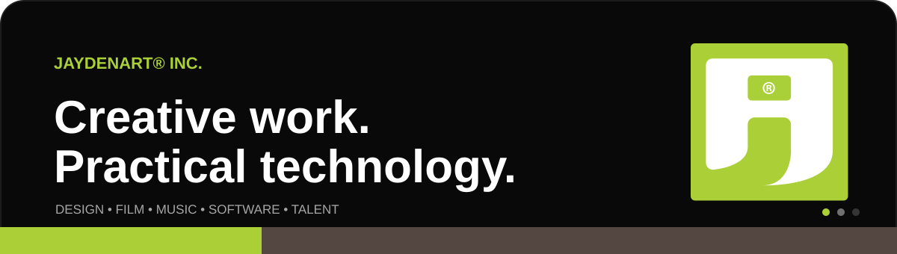

  <a href="https://www.JaydenART.com"><strong>Website</strong></a> &nbsp;•&nbsp;
  <a href="https://www.linkedin.com/company/jaydenart"><strong>LinkedIn</strong></a> &nbsp;•&nbsp;
  <a href="https://www.instagram.com/jaydenart_inc/"><strong>Instagram</strong></a> &nbsp;•&nbsp;
  <a href="https://www.youtube.com/c/JaydenART"><strong>YouTube</strong></a>

## Hello 👋

JaydenART® Inc. is a creative technology company working across design, film, music, software, the web, fashion, and talent. We are based in Beverly Hills, California, with branches in Malaysia.

This GitHub organization is where we share useful code, interface studies, and the practical lessons behind our work. Some projects are small by design. They solve one problem clearly, explain the decisions, and leave enough room for other people to adapt them.

Founded and led by [Jayden Yoon ZK](https://github.com/JaydenYoonZK).

## Open source 🛠️

| Project | What it is for |
|---|---|
| [**Realistic 3D CSS Button**](https://github.com/JaydenART/JaydenART_Realistic_3D_CSS_Button) | A dependency-free button whose cap moves while its edge and ground shadow stay anchored. Includes an accessible live demo and reusable CSS. |
| [**Practical browser tools**](https://jaydenyoonzk.github.io/projects/) | Free tools and references for WordPress, WHMCS, package research, crawler policy, and clean publishing workflows, maintained by our founder. |

We welcome careful bug reports, real compatibility evidence, documentation fixes, and focused pull requests. The shared [contributing guide](../CONTRIBUTING.md) explains how to take part.

## What we make ✨

| Team | Focus |
|---|---|
| **JaydenART Creatives Inc.** | Brand identity, UI and UX, digital art, print, products, and interiors. |
| **JaydenART Film Inc.** | Story, production, visual effects, and post-production. |
| **JaydenART Music Inc.** | Music production, foley, voice, and distribution. |
| **JaydenART Talent Inc.** | Representation and development across creative, technical, and performing disciplines. |
| **JaydenART Tech Inc.** | Websites, hosting, apps, software, games, and practical internet tools. |

Our technology brands include [JaydenART Website](https://www.jaydenart.website), which brings hosting and website services together, and [JaydenART.Ai](https://www.jaydenart.ai), which is currently in development.

## How we work

Original work matters to us, but originality is not decoration. It should make something clearer, more useful, or more memorable. We pay attention to the small decisions, document what other people need to know, and keep improving after the first release.

## Talk to us 💬

- Company and project enquiries: [JaydenART.com](https://www.JaydenART.com)
- Open-source bugs and ideas: use the issue tracker in the relevant repository
- Sensitive security reports: follow our [security policy](../SECURITY.md)
- General GitHub contact: [GitHub@JaydenART.com](mailto:GitHub@JaydenART.com)

  <strong>ART brings out the best in you.</strong>

